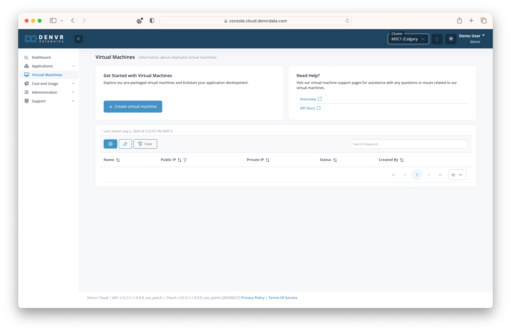

# Hugging Gaudi
- [Hugging Gaudi](#hugging-gaudi)
  - [Provisioning](#provisioning)
  - [Docker](#docker)
  - [Usage](#usage)
  - [Links](#links)

In collaboration with Intel, our team here at Denvr has been hard at work deploying dozens of Gaudi 2 nodes for our clients.
In terms of performance, the Gaudi 2 sits between the NVIDIA A100 and H100 lineups with more VRAM than both. 
Depending on your use case the Gaudi 2 offers competitive cost to performance. 
But how hard is it to get started?

In this blog post, we'll cover provisioning an Intel Gaudi 2 VM on Denvr Cloud, and how to run a simple ChatUI + TGI inference application.

## Provisioning

After logging into Denvr's [console](console.cloud.denvrdata.com), navigate to *'Virtual Machines'* tab using the left navigation menu and hit **"Create Virtual Machine"**.

<p float="left">
    
    
</p>

We'll start by giving our VM a name and selecting the instance type we want from either the on-demand or reserved pools. 
In our case, we'll select 'Intel Gaudi' from 'reserved-denvr'.


Next we'll select the OS and whether we want the Habana drivers and docker container runtime environment preinstalled (recommended).
We'll also specify any NFS shares (personal or shared) to mount in the VM.
Finally, we'll provide our SSH public key for access to the VM.


Hit **"Launch Instance"** and wait for the machine to come "ONLINE".

## Docker

Now that we have our Denvr VM we'll SSH into our machine.

```shell
> ssh ubuntu@<public_ip>
```
From this machine we'll just clone this demo repo and run the config.sh script

```shell
> git clone -b rf/hugginggaudi https://github.com/denvrdata/denvrdemos.git

> cd denvrdemos/hugginggaudi

> bash config.sh
Pulling down docker images
[+] Pulling 4/4
 ✔ chatui Pulled                                                                                                   0.5s
 ✔ mongo Pulled                                                                                                    0.5s
 ✔ caddy Pulled                                                                                                    0.5s
 ✔ tgi Pulled                                                                                                      0.6s

real    0m0.820s
user    0m0.012s
sys     0m0.015s
Enter an admin password: ***************************  % Total    % Received % Xferd  Average Speed   Time    Time     Time  Current
                                 Dload  Upload   Total   Spent    Left  Speed
100    14  100    14    0     0    334      0 --:--:-- --:--:-- --:--:--   341
Writing .config/caddy/Caddyfile
198.145.127.76.nip.io {
    reverse_proxy chatui:3000
    basicauth {
        admin $2a$14$BQtMRsjoT4sJcCQr5JWequ68N6oxD5TMlV4zO7r5cb0jIUYzqN26e
    }
}
Starting docker services
[+] Running 5/5
 ✔ Network hugginggaudi_default     Created                                                                        0.2s
 ✔ Container hugginggaudi-tgi-1     Healthy                                                                      123.1s
 ✔ Container hugginggaudi-mongo-1   Healthy                                                                        6.6s
 ✔ Container hugginggaudi-caddy-1   Started                                                                        1.0s
 ✔ Container hugginggaudi-chatui-1  Started                                                                      127.2s

real    2m7.780s
user    0m0.056s
sys     0m0.112s
Configuration complete. Open 198.145.127.76.nip.io/chat in your browser.
```

## Usage

Simply navigate to the URL provided in the script and you'll be prompted for your login credentials.


From here we're good to start query the LLM.


And there you have it! 
You've just deployed your first inference application on Intel Gaudi 2 with Denvr Cloud

## Links

Denvr:
- [Denvr Registration](https://console.cloud.denvrdata.com/account/register-tenant)
- [Denvr Sales Team](https://www.denvrdata.com/contact-sales)

Huggingface:
- [TGI Gaudi](https://github.com/huggingface/tgi-gaudi)
- [ChatUI](https://github.com/huggingface/chat-ui)

Caddy:
- [Caddy - The Ultimate Server wih Automatic HTTPS](https://caddyserver.com/)
- [nip.io - wildcard DNS for any IP Address](https://nip.io/)