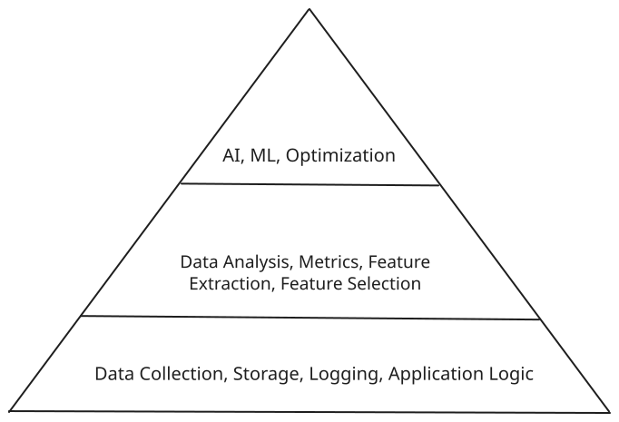

# YARA - LangChain Edition

## Intro

Denvr presented an interactive tutorial at the Intel Developer Hub during SC'24.
Our "Yet another RAG assistant for technical research" tutorial covered:

1. Retrieval augmented generation (RAG) and why it's a useful tool
2. Storing embedding vectors in a typical relational database with other application state
3. Composing a modular RAG pipeline without external services using LangChain
4. Supporting Intel Gaudi hardware with a custom TextGenerationPipeline subclass
5. Putting this all behind a simple UI

To see the original tutorial contentn checkout the [sc24 folder](https://github.com/denvrdata/denvrdemos/tree/main/langchain/sc24).

To keep things focused we've decided to assume you already know what RAG is.
If you'd like a refresher on how RAG works check out our original [yara](https://github.com/denvrdata/denvrdemos/tree/main/yara) post. 
For everything else we've decided to break this up into 3 parts:

- Part 1: Using relational DBs in RAG pipelines with LangChain
- Part 2: Running on Intel Gaudi 2
- Part 3: Adding a simple UI

## Part I - Using relational DBs in RAG pipelines with LangChain



Despite the hype, RAG pipelines and LLMs are only as useful as the applications that can use them.
Anyone who has deployed machine learning or optimization platforms to production will tell you that every custom AI, ML or optimization solutions depends heavily on quality data, monitoring, analysis and application logic. Otherwise, you're stuck with garbage in and garbage out.


We've previously discussed, how overly broad foundation models are limited by stale public datasets.
Similarly, using external RAG services introduces security concerns around what private data can be used.
For these reasons, the ability to integrate these pipelines into existing software and data ecosystems is vital to more widespread and focused adoption.

In this post, we're going to show how modular Python frameworks can be used to tailor these models to your existing software stack. 
In our case, we're using LangChain as a relatively modular out-of-the-box solution.
LangChain includes various document scrapers, data loaders, LLMs, embedding models and databases vector stores.
Despite what some older blog posts have indicated, we found the amount of documentation and online resources more than adequate in 2024.
That being said, other libraries exist and may fit your needs better if you find LangChain too opinionated.

### Requirements

1. Familiar with Python
2. Rough understanding of RAG

### Components

- [LangChain](https://python.langchain.com/docs/introduction/) - Our primary python framework
- [DuckDB](https://duckdb.org/docs/index) - Our sample relational database, but this could also be sqlite or postgres
- [HuggingFace](https://huggingface.co/) - For downloading our LLM and embedding model checkpoints

### Dependencies

```shell
> python3 -m venv .venv
> source .venv/bin/activate
(.venv)> pip install torch langchain-community langchain-huggingface transformers lxml bs4 duckdb
```
Alternatively, you can download our [requirements.txt](https://github.com/denvrdata/denvrdemos/langchain/nvidia/requirements.txt) and run.
```shell
(.venv)> pip install -r requirements.txt
```

### Setup

We'll start by adding a bunch of imports for the tools we'll be using.
```python
import duckdb
import json
import logging
import os

from langchain_core.documents import Document
from langchain_core.output_parsers import StrOutputParser
from langchain_core.prompts import ChatPromptTemplate
from langchain_core.runnables import RunnablePassthrough
from langchain_community.vectorstores import DuckDB
from langchain_community.document_loaders import SitemapLoader
from langchain_text_splitters import RecursiveCharacterTextSplitter
from langchain_huggingface.embeddings import HuggingFaceEmbeddings
from langchain_huggingface.llms import HuggingFacePipeline

from transformers import pipeline
```

Next we'll enable logging as that always helps keep track of things.
```python
logging.basicConfig(
    format="%(asctime)s - %(levelname)s - %(name)s - %(message)s",
    datefmt="%m/%d/%Y %H:%M:%S",
    level=logging.INFO,
)
LOGGER = logging.getLogger(__name__)
```

### Data

LangChain supports a pretty wide variety of vector stores, ranging from specific vector databases to simply tables in a relational database.
For simplicity we're going to use DuckDB as our relational DB example.
You could also use postgres with pgvector if that's what your software stack already supports.

Let's start by creating a database connection.

```python
# Name of the database file on disk
DB = "store.db"

# Disable external access and auto install/loading of extension
# We don't need these and this is more secure.
DB_CONFIG = {
    "enable_external_access": "false",
    "autoinstall_known_extensions": "false",
    "autoload_known_extensions": "false",
}
CONN = duckdb.connect(database=DB, config=DB_CONFIG)
```

We'll also define a simple downloads table and add a single entry to it.
This table maps local files to their remote sources.
If the destination isn't specified then it means we haven't downloaded it yet.

```python
LOGGER.debug("Creating downloads table if not present")
CONN.sql(
    """
    CREATE TABLE IF NOT EXISTS downloads (
        source VARCHAR PRIMARY KEY,
        destination VARCHAR,
        sitename VARCHAR
    );
    """
)

SITE_NAME = "denvr"
SITE_XML = "https://docs.denvrdata.com/docs/sitemap.xml"

LOGGER.info("Adding %s to downloads table", SITE_XML)
CONN.execute(
    "INSERT INTO downloads VALUES ( $source, $destination, $sitename )",
    { "source": SITE_XML, "destination": "", "sitename" : SITE_NAME },
)
```

Now we can define a generic `download` function which finds missing downloads from the table 
and uses `SitemapLoader` to download them.

```python
def download(conn):
    # For extracting page text
    parsing_func = lambda x: x.main.get_text().encode("ascii", "ignore")

    # Identify missing downloads
    sites = conn.sql(
        """
        SELECT source, destination, sitename
        FROM downloads 
        WHERE length(destination) == 0
        """
    )

    count = 0
    for (url, _, name) in sites.fetchall():
        LOGGER.info("Downloading pages from %s", url)
        loader = SitemapLoader(url, parsing_function=parsing_func)

        parent_dir = os.path.join("docs", name)
        os.makedirs(parent_dir, exist_ok=True)

        for document in loader.lazy_load():
            # Extract the source URL
            source = document.metadata['source']
            LOGGER.info("Process %s", source)

            # Determine the local file location, converting to a flat structure.
            relpath = os.path.relpath(source, url).replace("..", "").strip('/').replace("/", "__")
            ext = ".json"

            if relpath in ["", "."]:
                relpath = "index"
            
            destination = os.path.join(parent_dir, relpath + ext)
            LOGGER.info("Saving document to %s", destination)

            # Write the document as a .json file
            with open(destination, "w") as fobj:
                json.dump(dict(document), fobj, ensure_ascii=True, indent=4)

            # Update the downloads table
            conn.execute(
                "INSERT OR REPLACE INTO downloads VALUES ( $source, $destination, $sitename, )",
                { "source": source, "destination": destination, "sitename" : name },
            ).fetchall()

            count += 1
    
    return count
```

Okay, that was a bit of a wall of text, but now you can repeatedly trigger new downloads by simply 
adding a new site to the table and running the `download(CONN)` function.

```python
download(CONN)

02/10/2025 10:00:43 - INFO - __main__ - Downloading pages from https://docs.denvrdata.com/docs/sitemap.xml
Fetching pages: 100%|##########################################################################################| 1/1 [00:00<00:00,  3.13it/s]
Fetching pages: 100%|########################################################################################| 37/37 [00:17<00:00,  2.13it/s]
02/10/2025 10:01:02 - INFO - __main__ - Process https://docs.denvrdata.com/docs/
02/10/2025 10:01:02 - INFO - __main__ - Saving document to docs/denvr/index.json
02/10/2025 10:01:02 - INFO - __main__ - Process https://docs.denvrdata.com/docs/overview/getting-started
02/10/2025 10:01:02 - INFO - __main__ - Saving document to docs/denvr/overview__getting-started.json
...
02/10/2025 10:01:03 - INFO - __main__ - Process https://docs.denvrdata.com/docs/additional-information/policies/maintenance-policy
02/10/2025 10:01:03 - INFO - __main__ - Saving document to docs/denvr/additional-information__policies__maintenance-policy.json
37

CONN.table('downloads')

┌──────────────────────┬────────────────────────────────────────────────────────────────────┬──────────┐
│        source        │                            destination                             │ sitename │
│       varchar        │                              varchar                               │ varchar  │
├──────────────────────┼────────────────────────────────────────────────────────────────────┼──────────┤
│ https://docs.denvr…  │                                                                    │ denvr    │
│ https://docs.denvr…  │ docs/denvr/index.json                                              │ denvr    │
│ https://docs.denvr…  │ docs/denvr/overview__getting-started.json                          │ denvr    │
│ https://docs.denvr…  │ docs/denvr/overview__getting-started__launch-a-virtual-machine.j…  │ denvr    │
│ https://docs.denvr…  │ docs/denvr/overview__getting-started__secure-shell-ssh-best-prac…  │ denvr    │
│ https://docs.denvr…  │ docs/denvr/overview__getting-started__api-usage-samples.json       │ denvr    │
│ https://docs.denvr…  │ docs/denvr/overview__getting-started__registration.json            │ denvr    │
│ https://docs.denvr…  │ docs/denvr/overview__data-centers.json                             │ denvr    │
│ https://docs.denvr…  │ docs/denvr/overview__shared-responsibility-model.json              │ denvr    │
│ https://docs.denvr…  │ docs/denvr/overview__technical-support.json                        │ denvr    │
│          ·           │                      ·                                             │   ·      │
│          ·           │                      ·                                             │   ·      │
│          ·           │                      ·                                             │   ·      │
│ https://docs.denvr…  │ docs/denvr/additional-information__faqs__using-github-with-ssh-k…  │ denvr    │
│ https://docs.denvr…  │ docs/denvr/additional-information__faqs__data-persistence-and-re…  │ denvr    │
│ https://docs.denvr…  │ docs/denvr/additional-information__faqs__do-you-support-kubernet…  │ denvr    │
│ https://docs.denvr…  │ docs/denvr/additional-information__faqs__installing-gpu-drivers.…  │ denvr    │
│ https://docs.denvr…  │ docs/denvr/additional-information__faqs__what-is-the-network-ban…  │ denvr    │
│ https://docs.denvr…  │ docs/denvr/additional-information__faqs__what-ports-are-publicly…  │ denvr    │
│ https://docs.denvr…  │ docs/denvr/additional-information__faqs__what-is-persistent-loca…  │ denvr    │
│ https://docs.denvr…  │ docs/denvr/additional-information__faqs__adding-das-to-etc-fstab…  │ denvr    │
│ https://docs.denvr…  │ docs/denvr/additional-information__policies.json                   │ denvr    │
│ https://docs.denvr…  │ docs/denvr/additional-information__policies__maintenance-policy.…  │ denvr    │
├──────────────────────┴────────────────────────────────────────────────────────────────────┴──────────┤
│ 38 rows (20 shown)                                                                         3 columns │
└──────────────────────────────────────────────────────────────────────────────────────────────────────┘
```

At this point you can see we have a nicely populated table of downloaded files in our relational database.
Okay, yeah, that isn't very interesting. 
The idea is that this represents pretty standard application logic you'd likely want to store in a relational database.
Maybe you also have tables for chat history, inventory, etc?

### Embeddings

Okay, cool, so we have a bunch of downloaded files with some mappings in our `'downloads'` table.
Now we want to break these files into chunks and store them as embedding vectors we can then search.
We can just use LangChain to couple an embedding model with an `'embeddings'` table to solve this for us.

```python
LOGGER.info("Creating a vector store in the duckdb 'embeddings' table.")

# Since embedding models are pretty small and we only have 1 GPU on our local dev machine
# we'll just pass CPU as the device.
EMBEDDINGS = DuckDB(
    connection=CONN,
    embedding=HuggingFaceEmbeddings(
        model_name="sentence-transformers/all-MiniLM-L6-v2", 
        model_kwargs={'device': 'cpu'},
    ),
)

TEXT_SPLITTER = RecursiveCharacterTextSplitter(
    chunk_size=1500,
    chunk_overlap=100,
    length_function=len,
    is_separator_regex=False,
)

# Traverse the downloads directory
for (root, _, files) in os.walk("docs"):
    for filename in files:
        LOGGER.info("Chunked embeddings for %s", filename)
        with open(os.path.join(root, filename)) as fobj:
            data = json.load(fobj)
            page = Document(**data)
            docs = TEXT_SPLITTER.split_documents([page])
            EMBEDDINGS.add_documents(docs)

CONN.table('embeddings')

┌──────────────────────┬──────────────────────┬──────────────────────┬─────────────────────────────────────────────────────────────────────────────┐
│          id          │         text         │      embedding       │                                  metadata                                   │
│       varchar        │       varchar        │       float[]        │                                   varchar                                   │
├──────────────────────┼──────────────────────┼──────────────────────┼─────────────────────────────────────────────────────────────────────────────┤
│ 6fbd89cb-b078-4770…  │ Additional Informa…  │ [0.083564855, 0.02…  │ {"source": "https://docs.denvrdata.com/docs/additional-information/faqs/w…  │
│ f149d6c6-526e-4e87…  │ OVERVIEW Getting s…  │ [-0.10473128, -0.0…  │ {"source": "https://docs.denvrdata.com/docs/overview/getting-started/api-…  │
│ 341c595c-da75-48d9…  │ "gpus": 1, \n     …  │ [0.04810389, -0.04…  │ {"source": "https://docs.denvrdata.com/docs/overview/getting-started/api-…  │
│ 11c3363e-e8d6-4ef1…  │ Additional Informa…  │ [0.015738374, -0.0…  │ {"source": "https://docs.denvrdata.com/docs/additional-information/faqs/d…  │
│ 8c32cfbb-36c0-449d…  │ OVERVIEW Getting s…  │ [0.0023704378, -0.…  │ {"source": "https://docs.denvrdata.com/docs/overview/getting-started", "l…  │
│ 5346200a-d9ec-4cba…  │ API Reference Virt…  │ [-0.032674532, -0.…  │ {"source": "https://docs.denvrdata.com/docs/api-reference/virtual-machine…  │
│ 9c2d2739-ff8a-40c9…  │ Additional Informa…  │ [-0.004571308, -0.…  │ {"source": "https://docs.denvrdata.com/docs/additional-information/faqs",…  │
│ 95f64353-e4af-4b5d…  │ PLATFORM Networkin…  │ [0.02802037, -0.03…  │ {"source": "https://docs.denvrdata.com/docs/platform/networking", "loc": …  │
│ 9972106b-34f2-4dd5…  │ Additional Informa…  │ [0.04543331, -0.00…  │ {"source": "https://docs.denvrdata.com/docs/additional-information/faqs/w…  │
│ a27afe5c-909f-4820…  │ API Reference Appl…  │ [0.0018511884, -0.…  │ {"source": "https://docs.denvrdata.com/docs/api-reference/applications", …  │
│          ·           │          ·           │          ·           │                                      ·                                      │
│          ·           │          ·           │          ·           │                                      ·                                      │
│          ·           │          ·           │          ·           │                                      ·                                      │
│ 1f3058cc-a907-4c26…  │ PLATFORM Dashboard…  │ [0.00074250315, -0…  │ {"source": "https://docs.denvrdata.com/docs/platform/dashboard", "loc": "…  │
│ cb55ed40-36cf-446a…  │ Additional Informa…  │ [-0.010970566, 0.0…  │ {"source": "https://docs.denvrdata.com/docs/additional-information/faqs/d…  │
│ 89bfb6ad-1f94-46c3…  │ API Reference Clus…  │ [0.0061399355, -0.…  │ {"source": "https://docs.denvrdata.com/docs/api-reference/clusters", "loc…  │
│ 9f779c67-70da-4b7b…  │ Additional Informa…  │ [0.061346054, -0.0…  │ {"source": "https://docs.denvrdata.com/docs/additional-information/faqs/w…  │
│ 8a5b72b8-869a-4a22…  │ PLATFORM Billing O…  │ [-0.0063742553, 0.…  │ {"source": "https://docs.denvrdata.com/docs/platform/billing", "loc": "ht…  │
│ a47afa8f-f550-4cac…  │ Additional Informa…  │ [-0.03471506, -0.0…  │ {"source": "https://docs.denvrdata.com/docs/additional-information/faqs/u…  │
│ 618735e5-5bbf-4d15…  │ PLATFORM Storage D…  │ [-0.008758875, -0.…  │ {"source": "https://docs.denvrdata.com/docs/platform/storage", "loc": "ht…  │
│ e5fe2c2f-d31d-4f30…  │ PLATFORM Applicati…  │ [0.007258774, 0.03…  │ {"source": "https://docs.denvrdata.com/docs/platform/applications", "loc"…  │
│ 473763c1-9513-4dea…  │ OVERVIEW Getting s…  │ [-0.06630368, -0.1…  │ {"source": "https://docs.denvrdata.com/docs/overview/getting-started/regi…  │
│ 971da775-6fe5-4020…  │ Additional Informa…  │ [-0.038221695, -0.…  │ {"source": "https://docs.denvrdata.com/docs/additional-information/polici…  │
├──────────────────────┴──────────────────────┴──────────────────────┴─────────────────────────────────────────────────────────────────────────────┤
│ 42 rows (20 shown)                                                                                                                     4 columns │
└──────────────────────────────────────────────────────────────────────────────────────────────────────────────────────────────────────────────────┘

```

Again, now you should see a pretty standard table consisting of and `id`, `text`, `embedding` and `metadata`.
We can also perform a similarity search on this table.

```python
EMBEDDINGS.similarity_search(
    "What network bandwidth does Denvr Dataworks offer?"
)[0].page_content

Additional InformationFAQsWhat is the network bandwidth?Internet bandwidth depends on many factors including ISP speed, use of multiple connections, serving capacity, and receiving bandwidth ...
```

### LLM

Now that we have a model coupled to an `'embeddings'` table now we need to connect that to an LLM.
For simplicity we'll just use [Qwen/Qwen2.5-0.5B-Instruct](https://huggingface.co/Qwen/Qwen2.5-0.5B-Instruct).

```python
LLM = HuggingFacePipeline(
    pipeline=pipeline(
        'text-generation', 
        model='Qwen/Qwen2.5-0.5B-Instruct', 
        device='cuda',
        max-
    )
)
LLM.invoke("What is a Large Language Model?")
```

NOTE: We using a small Qwen2.5 model for 2 reasons

1. We're focused on learning rather than performance
2. You can still set device='cpu'` if you don't have a GPU. It'll just be slow :)

```
'What is a Large Language Model? A Large Language Model (LLM) is a type of artificial intelligence (AI) that can generate human-like text based on a large amount of data...'
```

## RAG

Okay, now putting it all together, we have two last steps.

1. Define our RAG Prompt

```python
PROMPT_TEMPLATE = """
--- Instructions ---
You are a friendly AI assistant for onboarding new Denvr Dataworks employees. 
Use a conversational tone and provide helpful and informative responses, utilizing external knowledge when possible.

"**Step 1: Parse Context Information** "
Extract and utilize relevant knowledge from the provided context.
**Step 2: Analyze User Query**
Carefully read and comprehend the user's query, pinpointing the key concepts, entities, and intent behind the question.
**Step 3: Determine Response**
If the answer to the user's query can be directly inferred from the context information, provide a concise and accurate response in the same language as the user's query.
**Step 4: Handle Uncertainty**
If you don't know the answer, simply state that you don't know. If the answer is not clear, ask the user for clarification to ensure an accurate response.
**Step 5: Respond in User's Language**
Maintain consistency by ensuring the response is in the same language as the user's query.
**Step 6: Provide Response**
Generate a clear, concise, and informative response to the user's query, adhering to the guidelines outlined above.

--- Context ---
{context}

"""

PROMPT = ChatPromptTemplate.from_messages(
    [
        ("system", PROMPT_TEMPLATE),
        ("human", "{question}")
    ]
)
```

This is almost identical to the template we used in the yara example with Open WebUI.

2. Chain our components together
```python
# A couple helper functions to
# 1. Retrieve the relevant chunks
# 2. Format those docs for aour prompt context
retrieve_docs = (lambda query: query["question"]) | EMBEDDINGS.as_retriever(search_kwargs={"k": 1})
format_docs = lambda docs: "\n\n".join(doc.page_content for doc in docs)

# Given a query we're going to
# 1. Fetch the relevant docs
# 2. Build our prompt with the question and formatted relevant context
# 3. Pass that to the LLM as the new prompt
# 4. Extract just the string output
LOGGER.info("Constructing our RAG pipeline")
RAG = RunnablePassthrough.assign(
    context=retrieve_docs,
).assign(
    answer=(
        {
            "question": lambda query: query["question"],
            "context": lambda query: format_docs(query["context"]),
        }
        | PROMPT
        | LLM.bind(skip_prompt=True)
        | StrOutputParser()
    )
)
```

## Questions

### What is a Large Language Model?

```python
print(RAG.invoke({"question": "What is a Large Language Model?"})["answer"])


Assistant: A Large Language Model (LLM) is a type of artificial intelligence (AI) system designed to generate human-like text based on input data. These models typically consist of several layers of neural networks that process large amounts of text data, including domain-specific language, context, and meta-data such as authorship, date, and location. LLMs can learn and understand complex patterns and relationships within text, which allows them to generate coherent and grammatically correct outputs.
...
```

### What network bandwidth does Denvr Dataworks offer?
```python
print(RAG.invoke({"question": "What network bandwidth does Denvr Dataworks offer?"})["answer"])

Assistant:

Denvr Dataworks offers up to 25 Gbps of internet bandwidth...
```
We can see that it picks up the 25 Gbps inter-cluster speeds in MSC1 and the 100 Gbps internet bandwidth in HOU1, but it's missing the internet bandwidth in MSC1 and the inter-cluster speeds in MSC1.

### What instance types does Denvr Dataworks offer?
```python
print(RAG.invoke({"question": "What instance types does Denvr Dataworks offer?"})["answer"])

Assistant: The Denvr Dataworks offers several instance types:

- **Applications**: Supports Notebooks, IDEs, and private custom containers
- **Virtual Machines**: Supports 1x, 2x, 4x, and 8x GPU configurations
- **Bare Metal**: Direct access to host for peak performance

...
```

Okay, so it correctly picked up and summarized our 3 main service offerings. 
However, it could have provided more details on the actual hardware being offer (e.g., A100s, H100s, Gaudi).

## Conclusion

And there you have it. 
You've just glued various RAG components together in Python with the flexibilty of swapping out which datasets, database, models, etc you use for your particular software stack. 
This is also using models small enough you can run on your local laptop.
In our next post, we'll show how to run this with a larger model on one of Denvr's Intel Gaudi 2 nodes.
 