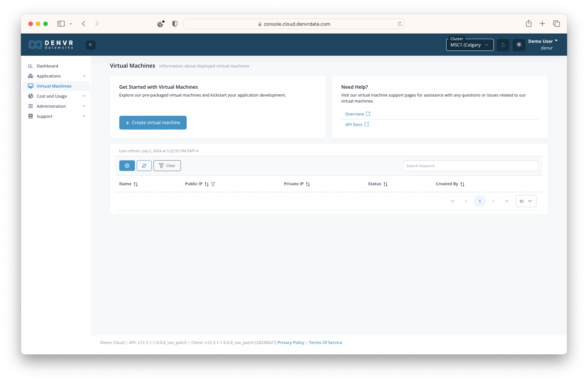
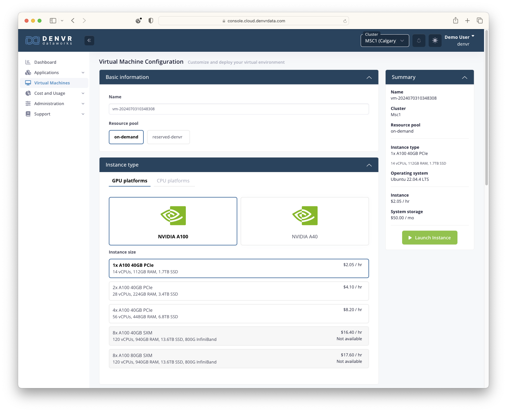
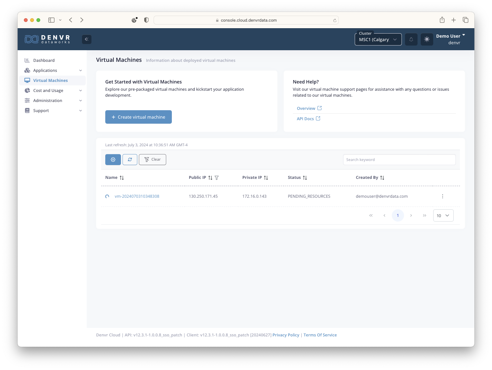

# YARA - Yet Another RAG Assistant
- [YARA - Yet Another RAG Assistant](#yara---yet-another-rag-assistant)
  - [Background](#background)
  - [Accounts](#accounts)
    - [NVIDIA (Required)](#nvidia-required)
    - [Denvr (Optional)](#denvr-optional)
  - [Provisioning](#provisioning)
    - [NGC Keys](#ngc-keys)
    - [Denvr VM](#denvr-vm)
    - [Docker](#docker)
  - [Configuration](#configuration)
    - [Authentication](#authentication)
    - [Documents](#documents)
    - [YARA Model](#yara-model)
    - [Usage](#usage)
  - [Conclusion](#conclusion)
  - [Links](#links)

In Denvr’s webinar on Aug 22nd, 2024, we showed how a **Retrieval Augmented Generation (RAG)** pipeline can be used to customize a foundation **Large Language Model (LLM)**, without expensive fine tuning jobs. 
While this approach has several applications, we demonstrated building an AI assistant for onboarding new Denvr employees. 
In this blog post, we’ll review some of the key concepts about RAG and dig a little deeper into how to deploy your own stack on Denvr Cloud.

## Background

Over the past few years, tools like ChatGPT and Copilot have made LLMs ubiquitous. 
These massive models are beginning to show up in everything from our email clients to our code editors. 
Despite this, LLMs are still just probabilistic models, trained on finite datasets. 
As a result, they are still subject to the following weaknesses:

- **Overly General** - due to the amount of data it was trained on
- **Static Knowledge** - training data represents a static snapshot of the world
- **Lacks Citations** - apart from plagiarism, this limits how we can learn and vet LLM responses
- **Hallucinations** - prone to make up answers that only sound correct

RAG pipelines are one way to mitigate these weakness by including a search component, and some prompt engineering. 
The diagram below covers one of the more common workflows, incorporating an embedding model and a vector database. 
Conceptually, you really just need a:

- **Document Store** - you can search with the input prompt
- **Query Augmentation Step** - to incorporate that relevant data/context into the original prompt you’re sending to the LLM.


In our diagram, we are:

1. Populating a vector database by:
   1. Parsing the raw documents (e.g., doc, pdf, html)
   2. Sending the raw text through a small embedding model (similar to the embedding layers incorporated into LLMs)
   3. Inserting the embedded text into the database
2. Running our original prompt through the same embedding model and using the result to query the database for relevant stored context. 
3. Augmenting the original prompt with the most relevant chunks of context found and send that new prompt to the LLM. 

A nice feature of this approach is that we can experiment with different search and query augmentation strategies independent of one another. 
Similarly, you can also experiment with different LLMs, embedding models and reference datasets.


## Accounts

### NVIDIA (Required)

Since we're using an NVIDIA NIM container for our backend / foundation LLM, we'll need an NVIDIA account.
We'll assume you don't already have access to NVIDIA enterprise and would like to signup for a [free developer account](https://developer.nvidia.com/login).


Once you've signed up, make sure to wait for an email from `account@nvidia.com` with the subject "NVIDIA Account Created".
You'll need to verify your email and accept the terms before any personal access tokens you generate will be usable.

### Denvr (Optional)

Technically, you just need access to a linux box with the NVIDIA GPU(s), drivers and container runtime.
That being said, if you're gonna use a cloud provider anyway, why not Denvr? :)

You can register for an account with Denvr directly from our [console](https://console.cloud.denvrdata.com/account/register-tenant). 
For a free trial, please contact our [sales team](https://www.denvrdata.com/contact-sales).


## Provisioning

### NGC Keys

In order to pull down an NVIDIA NIM container you'll need to login to your [developer account](https://developer.nvidia.com/login) and navigate to [NGC setup page](https://org.ngc.nvidia.com/setup/personal-keys).


When you hit **"Generate Personal Key"**, you'll need to give your key a name and expiration.
At minimum, you should authorize access to "NGC Catalog".
You'll also want to save token `nvapi-****` somewhere safe, like in a password manager.

### Denvr VM

After logging into Denvr's [console](console.cloud.denvrdata.com), navigate to *'Virtual Machines'* tab using the left navigation menu and hit **"Create Virtual Machine"**.

<p float="left">
    
    
</p>

We'll start by giving our VM a name and selecting the instance type we want from either the on-demand or reserved pools.



Next we'll select the OS and whether we want the NVIDIA drivers and docker container runtime environment preinstalled (recommended).


We'll also specify any NFS shares (personal or shared) to mount in the VM.
Finally, we'll provide our SSH public key for access to the VM.


Hit **"Launch Instance"** and wait for the machine to come "ONLINE".



### Docker

Now that we have our NGC key and Denvr VM we'll SSH into our machine.

```shell
> ssh ubuntu@<public_ip>
```
From this machine we'll just clone this demo repo and run the config.sh script

```shell
> git clone -b rf/yara https://github.com/denvrdata/denvrdemos.git

> cd denvrdemos/yara

> bash config.sh
Entry your NGC API Key (nvapi-****): nvapi-***************************************************************
Writing key to .config/ngc-api-key
Writing key to docker environment variable in .config/nim.env
  % Total    % Received % Xferd  Average Speed   Time    Time     Time  Current
                                 Dload  Upload   Total   Spent    Left  Speed
100    15  100    15    0     0    354      0 --:--:-- --:--:-- --:--:--   357
Writing .config/caddy/Caddyfile
198.145.127.121.nip.io {
    reverse_proxy webui:8080
}
HTML docs already found. Skipping download.
Logging into nvcr.io
WARNING! Your password will be stored unencrypted in /root/.docker/config.json.
Configure a credential helper to remove this warning. See
https://docs.docker.com/engine/reference/commandline/login/#credential-stores

Login Succeeded
Pulling down docker images
[+] Pulling 49/49
 ✔ webui Pulled                                                                                                                78.4s
   ...
 ✔ caddy Pulled                                                                                                                 1.6s
   ...
 ✔ nim Pulled                                                                                                                 168.6s
   ...

real    2m49.063s
user    0m0.044s
sys     0m0.329s
Starting docker services
[+] Running 4/4
 ✔ Network yara_default    Created                                                                                              0.1s
 ✔ Container yara-nim-1    Healthy                                                                                            101.8s
 ✔ Container yara-webui-1  Healthy                                                                                            109.8s
 ✔ Container yara-caddy-1  Started                                                                                            110.0s

real    1m58.309s
user    0m0.024s
sys     0m0.024s
Configuration complete. Open 198.145.127.121.nip.io in your browser.
```

**NOTE** - We've already provided a copy of Denvr's public docs used in the webinar in `data/webui/docs`, but feel free to remove these and add your own. 
For reference, the command used to download the .html files is provided below. 

```
cd data/webui/docs
wget -q https://docs.denvrdata.com/docs/sitemap.xml --output-document - | grep -E -o "https://docs\.denvrdata\.com[^<]+" | wget -q -E -i - --wait 0
```

Open WebUI should be able to parse common file formats like .txt, .html and .pdf files.


## Configuration

During our webinar we stepped you through our preconfigured Open WebUI container.
In this section, we'll show you how to configure an Open WebUI RAG pipeline for yourself.
Feel free to play around with System Prompts, RAG Templates or use your own documents as we work through this section.

### Authentication

Assuming you haven't uncommented the line `WEBUI_AUTH=False` in the `.config/webui.env` file, you'll be prompted to create the initial admin account. 
For this example, we'll stick to simple email/password authentication.

<p float="left">
    
    
</p>

From here you can use the **"Admin Panel"** to add your friends and coworkers to your server.

<p float="left">
    
    
</p>

From the same Admin Panel, navigate to the *'settings'* tab and hit **"Connections"**.


We'll see that our OpenAI API endpoint is pointed to `http://nim:8000/v1`. 
The password doesn't matter, but Open WebUI requires it.

### Documents

As previously mentioned, we've already provided our public Denvr docs at `/data/docs` inside the container.
Before we can have our AI assistant reference these documents, we need to tell Open WebUI to scan these documents and store the embeddings in a vector database.
Thanksfully, Open WebUI already comes with a default embedding model and a vector database.
From the *'settings'* tab shown earlier, navigate to the **"Documents"** page.


On this page, we'll just hit the **"Scan"** button and replace the *'RAG Template'* with the following:

```
**Generate Response to User Query**
**Step 1: Parse Context Information**
Extract and utilize relevant knowledge from the provided context within `<context></context>` XML tags.
**Step 2: Analyze User Query**
Carefully read and comprehend the user's query, pinpointing the key concepts, entities, and intent behind the question.
**Step 3: Determine Response**
If the answer to the user's query can be directly inferred from the context information, provide a concise and accurate response in the same language as the user's query.
**Step 4: Handle Uncertainty**
If you don't know the answer, simply state that you don't know. If the answer is not clear, ask the user for clarification to ensure an accurate response.
**Step 5: Respond in User's Language**
Maintain consistency by ensuring the response is in the same language as the user's query.
**Step 6: Provide Response**
Generate a clear, concise, and informative response to the user's query, adhering to the guidelines outlined above.
User Query: [query]
<context>
    [context]
</context>
```
This template is almost identical to the one used [here](https://medium.com/@kelvincampelo/how-ive-optimized-document-interactions-with-open-webui-and-rag-a-comprehensive-guide-65d1221729eb).
We just added the following guard.
```
If you don't know the answer, simply state that you don't know
```

Hit the **"Save"** button at the bottom an navigate the the *'Workspace'* seen in the left sidebar.

### YARA Model

From the *'Workspace'* you should see the base model configuration:


From here, select **"Create a model"**


Fill out the following fields:

- Name: YARA
- Model ID: yara
- Base Model (From): meta/llama3-8b-instruct
- Description: Yet Another RAG Assistant

Model Params - System Prompt
```
You are a friendly AI assistant for onboarding new Denvr Dataworks employees. Use a conversational tone and provide helpful and informative responses, utilizing external knowledge when possible.
```

Under knowledge hit **"Select Documents"** and select *'COLLECTION - All Documents'*

Then hit **"Save & Create"** at the bottom.


### Usage

Okay, now lets play around with some prompts on both the base Llama 3 model and our YARA configuration.

We'll start by selecting the base Llama model from the "Workspace" window, and give it an easy question.

```
What is an Large Language Model?
```


As expected, the base Llama 3 model gives us reasonable output.

What if we ask it a question about Denvr Dataworks network bandwidth?
```
What network bandwidth does Denvr Dataworks offer?
```


Unfortunately, the base Llama model doesn't really know anything about Denvr Dataworks.
In this particular case, the LLM just gave us a generic response that isn't grounded in any particular documentation on our site.

what happens if we start another chat with our YARA model and ask it ths same question?


As we can see, the response from the YARA model utilizes specific values from our documentation.
For example, it correctly identifies the different network speeds like inter-cluster communication, InfiniBand, and shared Interenet access by region. 
The values are also clearly pulled from our provided docs. 
However, as this is a generative model, there are still some issues.
For example, it would be more helpful if it differentiate the network speeds offered in each region (e.g, MSC1 vs HOU1)

Just to make sure that wasn't a fluke, what if we ask the YARA model a question about Denvr's instance types?
```
What instance types does Denvr Dataworks offer?
```


Again, we get accurate responses, though a bit more detail on which region each instance type is offered in might be helpful.

Feel free to play around with different prompts and settings to see how it changes the output.


## Conclusion

In this guide, we reviewed what RAG pipelines are and why they're useful for building low cost and personalized chat tools. 
We also stepped through deploying a simple RAG application on Denvr Cloud using:

- **NVIDIA NIM** - for our inference backend
- **Open WebUI** - for our chat interface and RAG pipeline
- **Caddy + nim.io** - for automatic HTTPS encryption and a domain name

We also include instruction for adding your own documents.


## Links

Denvr:
- [Denvr Registration](https://console.cloud.denvrdata.com/account/register-tenant)
- [Denvr Sales Team](https://www.denvrdata.com/contact-sales)

NVIDIA:
- [Log in | NVIDIA Developer](https://developer.nvidia.com/login)
- [Getting Started | NVIDIA Docs](https://docs.nvidia.com/nim/large-language-models/latest/getting-started.html)
- [org.ngc.nvidia.com/setup/personal-keys](https://org.ngc.nvidia.com/setup/personal-keys)
- [Try NVIDIA NIM APIs](https://build.nvidia.com/explore/discover)

Caddy:
- [Caddy - The Ultimate Server wih Automatic HTTPS](https://caddyserver.com/)
- [nip.io - wildcard DNS for any IP Address](https://nip.io/)
